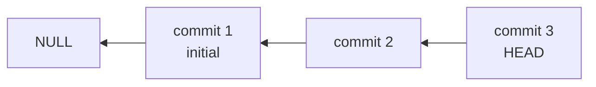
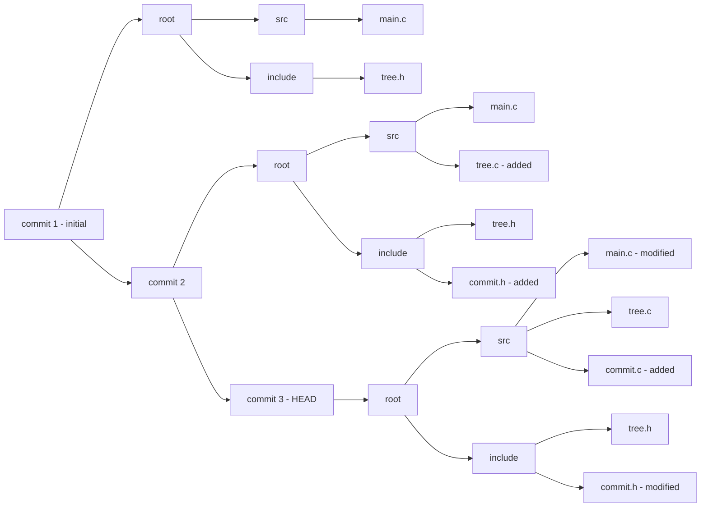

# cit

a version control system written in C from scratch — no tutorials, no copying git's internals, just reasoning through the problem.

## how it works

cit tracks changes using a custom tree structure similar to a Rose tree (N-ary tree):

- **internal nodes** → `struct tree` (directories)
- **leaf nodes** → `struct node` (files)
- each node stores its content, a hash, and a diff against the previous commit

commits form a backwards linked list, where each commit points to its parent:

each commit holds a snapshot of the tree at that point in time:

